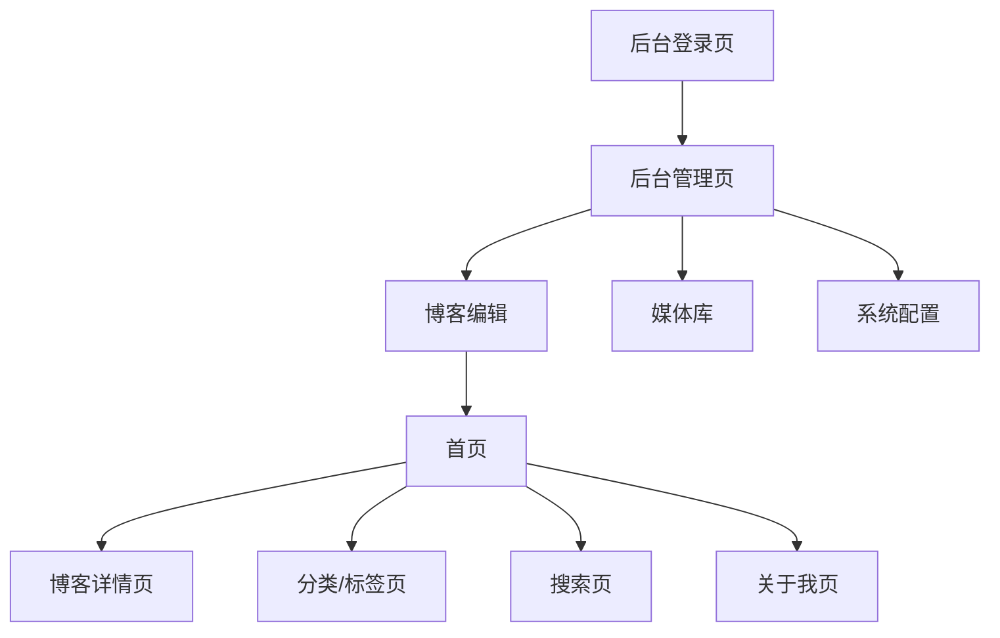

## 1. 产品概述

基于 Next.js + Supabase + GitHub 存储的个人博客系统，支持网页端可视化发布和管理博客内容。实现"一次开发、永久无代码发布"的轻量化博客体系，所有操作均在网页端完成，无需本地编写 Markdown 或执行 Git 推送。

目标用户为具备代码开发能力的个人开发者，解决传统博客需要本地编写和推送的痛点，提供完全基于网页端的内容管理体验。

## 2. 核心功能

### 2.1 用户角色

| 角色  | 注册方式                 | 核心权限                  |
| --- | -------------------- | --------------------- |
| 管理员 | 邮箱+密码 / GitHub OAuth | 后台登录、博客发布编辑、媒体管理、系统配置 |
| 访客  | 无需注册                 | 浏览博客、搜索内容、查看分类标签      |

### 2.2 功能模块

系统包含以下核心页面：

1. **首页**：博客列表展示、分页加载、分类标签筛选
2. **博客详情页**：完整内容展示、图片懒加载、作者信息
3. **分类/标签页**：按分类或标签筛选博客
4. **搜索页**：关键词全文检索
5. **关于我页**：个人简介和站点信息
6. **后台登录页**：管理员身份验证
7. **后台管理页**：博客编辑发布、媒体库管理、系统配置

### 2.3 页面详情

| 页面名称   | 模块名称 | 功能描述                       |
| ------ | ---- | -------------------------- |
| 首页     | 博客列表 | 按时间倒序展示博客，包含标题、封面图、摘要、分类标签 |
| 首页     | 分页加载 | 每页10条，支持滚动加载更多             |
| 首页     | 分类筛选 | 点击分类筛选相关博客                 |
| 首页     | 标签云  | 展示热门标签，点击筛选                |
| 博客详情页  | 内容展示 | 渲染完整正文、封面图、内嵌图片            |
| 博客详情页  | 作者信息 | 展示头像、简介、发布时间               |
| 博客详情页  | 图片处理 | 懒加载、自适应尺寸、失效占位图            |
| 分类/标签页 | 筛选结果 | 展示筛选后的博客列表，支持分页            |
| 搜索页    | 搜索框  | 输入关键词实时搜索                  |
| 搜索页    | 结果展示 | 显示匹配的博客列表                  |
| 关于我页   | 个人信息 | 展示头像、简介、站点说明               |
| 后台登录页  | 登录表单 | 邮箱密码或GitHub OAuth登录        |
| 后台管理页  | 编辑器  | 富文本/Markdown双模式编辑          |
| 后台管理页  | 图片上传 | 拖拽上传，自动生成GitHub链接          |
| 后台管理页  | 草稿功能 | 保存草稿，继续编辑                  |
| 后台管理页  | 预览功能 | 发布前预览最终效果                  |
| 后台管理页  | 媒体库  | 管理所有上传图片，支持搜索和删除           |
| 后台管理页  | 系统配置 | 修改站点信息、分类标签管理              |

## 3. 核心流程

### 管理员操作流程

1. 访问后台登录页，使用邮箱密码或GitHub账号登录
2. 进入后台管理页面，使用可视化编辑器编写博客
3. 上传图片时自动推送到GitHub仓库并生成Raw链接
4. 设置封面图、分类、标签等信息
5. 保存草稿或直接发布，数据存储到Supabase
6. 可在媒体库管理已上传的图片
7. 在系统配置中修改站点基本信息

### 访客浏览流程

1. 访问首页浏览博客列表
2. 点击博客标题进入详情页阅读
3. 使用分类标签或搜索功能查找特定内容
4. 访问关于我页面了解博主信息

## 4. 用户界面设计

### 4.1 设计风格

* **主色调**：深空蓝(#1a1a2e)配合纯净白(#ffffff)

* **辅助色**：活力橙(#ff6b35)用于强调和交互

* **按钮样式**：圆角矩形，悬停状态有明显颜色变化

* **字体**：中文使用思源黑体，英文使用Inter，正文字号16px

* **布局风格**：卡片式布局，阴影效果，清晰的内容层级

* **图标风格**：使用简洁的线性图标，保持视觉一致性

### 4.2 页面设计概述

| 页面名称  | 模块名称 | UI元素                             |
| ----- | ---- | -------------------------------- |
| 首页    | 导航栏  | 固定在顶部，包含logo、分类菜单、搜索框、关于我链接      |
| 首页    | 博客卡片 | 白色卡片，包含封面图(16:9)、标题、摘要、分类标签、发布时间 |
| 博客详情页 | 文章头部 | 大标题、封面图全宽显示、作者信息栏                |
| 博客详情页 | 正文区域 | 最大宽度800px，良好的行高和段落间距             |
| 后台管理页 | 侧边栏  | 深色侧边栏，包含各功能模块入口                  |
| 后台管理页 | 编辑器  | 全屏编辑区域，顶部工具栏，实时预览切换              |
| 媒体库   | 图片网格 | 响应式网格布局，悬停显示操作按钮                 |

### 4.3 响应式设计

采用桌面优先设计策略：

* 桌面端：最大宽度1200px，充分展示内容

* 平板端：768px-1024px，调整网格列数

* 手机端：<768px，单列布局，隐藏非必要元素

* 触摸优化：按钮最小44px，支持滑动操作

### 4.4 性能优化

* 图片使用Next.js Image组件，自动压缩和格式转换

* 首页和列表页采用ISR缓存，缓存时间1小时

* 支持渐进式加载，首屏内容优先渲染

* 代码分割，按需加载第三方库

