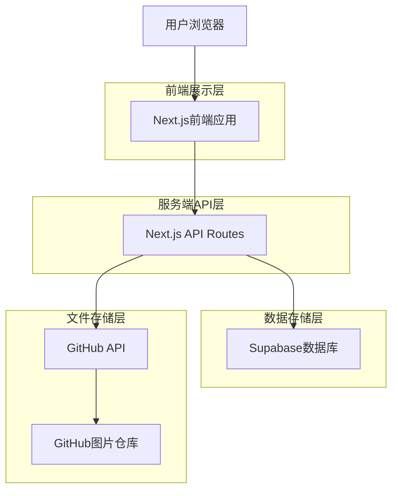
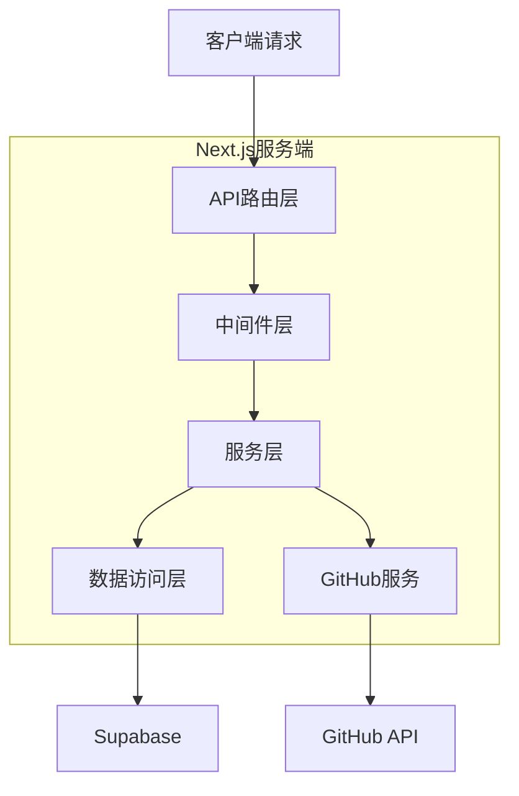
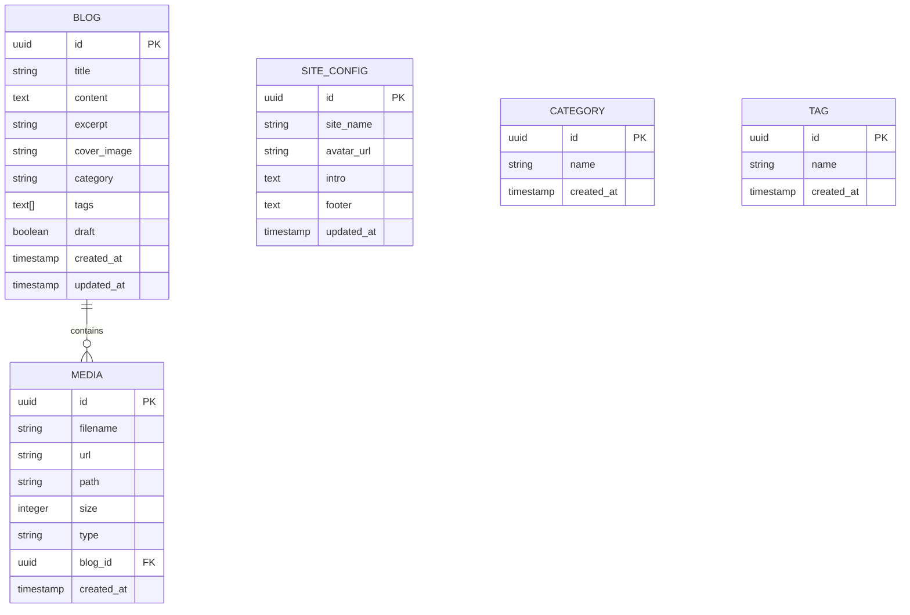

## 1. 架构设计



## 2. 技术描述

* **前端框架**: Next.js 14.x + React 18 + TypeScript

* **样式方案**: Tailwind CSS 3.x + PostCSS

* **UI组件**: Headless UI + 自定义组件

* **初始化工具**: create-next-app

* **数据库**: Supabase (PostgreSQL)

* **身份认证**: Supabase Auth

* **富文本编辑器**: Quill.js (支持Markdown模式)

* **图片处理**: Sharp (图片压缩和格式转换)

* **HTTP客户端**: Axios + GitHub REST API

* **部署平台**: Cloudflare Pages (使用 @cloudflare/next-on-pages)

## 3. 路由定义

| 路由路径                   | 页面用途      | 访问权限     |
| ---------------------- | --------- | -------- |
| /                      | 首页，博客列表展示 | 公开访问     |
| /blog/\[slug]          | 博客详情页     | 公开访问     |
| /category/\[category]  | 分类筛选页     | 公开访问     |
| /tag/\[tag]            | 标签筛选页     | 公开访问     |
| /search                | 搜索结果页     | 公开访问     |
| /about                 | 关于我页面     | 公开访问     |
| /admin/login           | 后台登录页     | 未登录访问    |
| /admin/dashboard       | 后台管理首页    | 需登录      |
| /admin/blog/new        | 新建博客      | 需登录      |
| /admin/blog/edit/\[id] | 编辑博客      | 需登录      |
| /admin/media           | 媒体库管理     | 需登录      |
| /admin/settings        | 系统配置      | 需登录      |
| /api/auth/login        | 登录接口      | POST     |
| /api/auth/logout       | 登出接口      | POST     |
| /api/upload/image      | 图片上传接口    | POST，需登录 |
| /api/blog              | 博客CRUD接口  | 需登录      |
| /api/media             | 媒体资源接口    | 需登录      |
| /api/settings          | 配置管理接口    | 需登录      |

## 4. API定义

### 4.1 认证相关API

**用户登录**

```Vue
POST /api/auth/login
```

请求参数：

| 参数名      | 类型     | 必需 | 描述   |
| -------- | ------ | -- | ---- |
| email    | string | 是  | 用户邮箱 |
| password | string | 是  | 用户密码 |

响应数据：

```json
{
  "success": true,
  "data": {
    "user": {
      "id": "uuid",
      "email": "user@example.com",
      "role": "admin"
    },
    "session": "jwt_token_string"
  }
}
```

### 4.2 博客管理API

**创建博客**

```Textile
POST /api/blog
```

请求参数：

| 参数名          | 类型        | 必需 | 描述    |
| ------------ | --------- | -- | ----- |
| title        | string    | 是  | 博客标题  |
| content      | string    | 是  | 博客内容  |
| excerpt      | string    | 否  | 摘要    |
| cover\_image | string    | 否  | 封面图链接 |
| category     | string    | 是  | 分类    |
| tags         | string\[] | 否  | 标签数组  |
| draft        | boolean   | 是  | 是否为草稿 |

**更新博客**

```
PUT /api/blog/[id]
```

**删除博客**

```
DELETE /api/blog/[id]
```

### 4.3 图片上传API

**上传图片到GitHub**

```
POST /api/upload/image
```

请求参数：

| 参数名   | 类型     | 必需 | 描述                      |
| ----- | ------ | -- | ----------------------- |
| image | File   | 是  | 图片文件                    |
| type  | string | 是  | 图片类型: blog/avatar/other |

响应数据：

```json
{
  "success": true,
  "data": {
    "url": "https://raw.githubusercontent.com/...",
    "path": "images/blog/2024/01/image.jpg",
    "size": 102400
  }
}
```

## 5. 服务端架构



### 5.1 分层说明

* **API路由层**: 处理HTTP请求，参数验证

* **中间件层**: 身份认证，权限检查，错误处理

* **服务层**: 业务逻辑处理，数据转换

* **数据访问层**: Supabase数据操作封装

* **GitHub服务**: GitHub API调用封装

## 6. 数据模型

### 6.1 实体关系图



### 6.2 数据库表定义

**博客表 (blogs)**

```sql
CREATE TABLE blogs (
    id UUID PRIMARY KEY DEFAULT gen_random_uuid(),
    title TEXT NOT NULL,
    content TEXT NOT NULL,
    excerpt TEXT,
    cover_image TEXT,
    category TEXT,
    tags TEXT[],
    images TEXT[],
    draft BOOLEAN DEFAULT false,
    created_at TIMESTAMP WITH TIME ZONE DEFAULT NOW(),
    updated_at TIMESTAMP WITH TIME ZONE DEFAULT NOW()
);

CREATE INDEX idx_blogs_created_at ON blogs(created_at DESC);
CREATE INDEX idx_blogs_category ON blogs(category);
CREATE INDEX idx_blogs_draft ON blogs(draft);
```

**媒体资源表 (media)**

```sql
CREATE TABLE media (
    id UUID PRIMARY KEY DEFAULT gen_random_uuid(),
    filename TEXT NOT NULL,
    url TEXT NOT NULL,
    path TEXT NOT NULL,
    size INTEGER,
    type TEXT CHECK (type IN ('blog', 'avatar', 'other')),
    blog_id UUID REFERENCES blogs(id) ON DELETE SET NULL,
    created_at TIMESTAMP WITH TIME ZONE DEFAULT NOW()
);

CREATE INDEX idx_media_created_at ON media(created_at DESC);
CREATE INDEX idx_media_type ON media(type);
```

**站点配置表 (site\_config)**

```sql
CREATE TABLE site_config (
    id UUID PRIMARY KEY DEFAULT gen_random_uuid(),
    site_name TEXT DEFAULT '个人博客',
    avatar_url TEXT,
    intro TEXT,
    footer TEXT,
    updated_at TIMESTAMP WITH TIME ZONE DEFAULT NOW()
);

-- 插入默认配置
INSERT INTO site_config (site_name, intro, footer) 
VALUES ('个人博客', '欢迎来到我的个人博客', '© 2024 个人博客. All rights reserved.');
```

**分类表 (categories)**

```sql
CREATE TABLE categories (
    id UUID PRIMARY KEY DEFAULT gen_random_uuid(),
    name TEXT UNIQUE NOT NULL,
    created_at TIMESTAMP WITH TIME ZONE DEFAULT NOW()
);
```

**标签表 (tags)**

```sql
CREATE TABLE tags (
    id UUID PRIMARY KEY DEFAULT gen_random_uuid(),
    name TEXT UNIQUE NOT NULL,
    created_at TIMESTAMP WITH TIME ZONE DEFAULT NOW()
);
```

### 6.3 Supabase访问权限

```sql
-- 博客表权限
GRANT SELECT ON blogs TO anon;
GRANT ALL PRIVILEGES ON blogs TO authenticated;

-- 媒体表权限
GRANT SELECT ON media TO anon;
GRANT ALL PRIVILEGES ON media TO authenticated;

-- 配置表权限
GRANT SELECT ON site_config TO anon;
GRANT ALL PRIVILEGES ON site_config TO authenticated;

-- 分类表权限
GRANT SELECT ON categories TO anon;
GRANT ALL PRIVILEGES ON categories TO authenticated;

-- 标签表权限
GRANT SELECT ON tags TO anon;
GRANT ALL PRIVILEGES ON tags TO authenticated;
```

### 6.4 RLS (Row Level Security) 策略

```sql
-- 博客表策略
ALTER TABLE blogs ENABLE ROW LEVEL SECURITY;

CREATE POLICY "公开博客可读" ON blogs FOR SELECT 
    USING (draft = false);

CREATE POLICY "管理员可管理所有博客" ON blogs FOR ALL 
    TO authenticated USING (true) WITH CHECK (true);

-- 配置表策略
ALTER TABLE site_config ENABLE ROW LEVEL SECURITY;

CREATE POLICY "站点配置可读" ON site_config FOR SELECT 
    USING (true);

CREATE POLICY "管理员可更新配置" ON site_config FOR UPDATE 
    TO authenticated USING (true) WITH CHECK (true);
```

